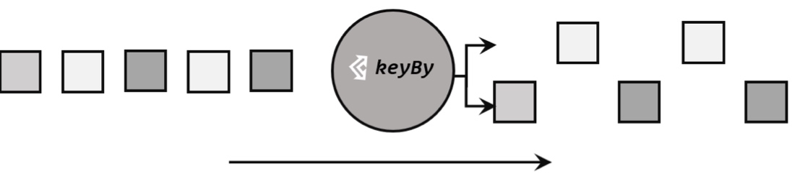
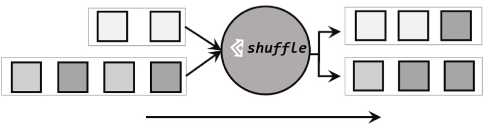
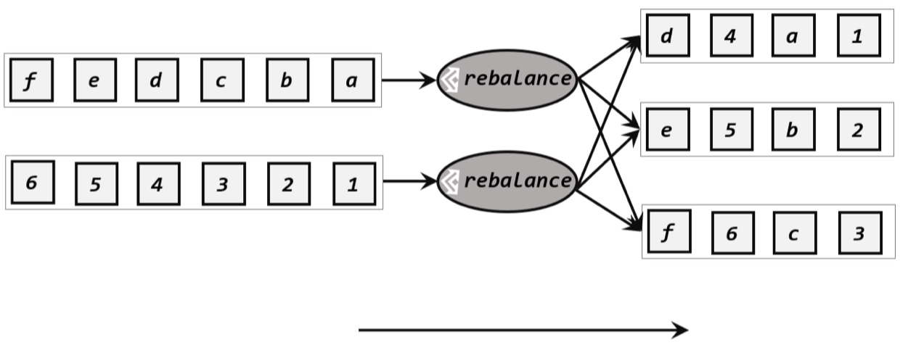
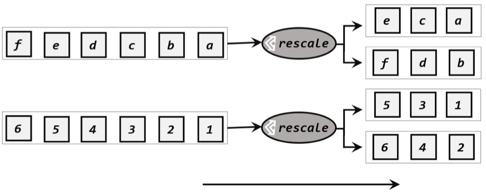
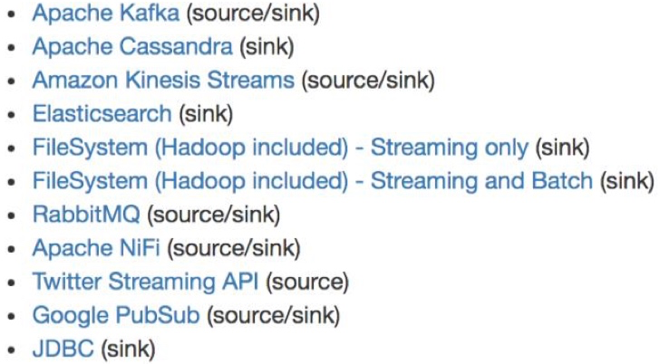

# DataStream API
代码执行流程
* 获取执行环境
* 读取数据源
* 定义基于数据的转换操作
* 定义计算结果的输出位置
* 出发程序执行

## 执行环境
获取的执行环境是StreamExecutionEnvironment类对象,有三种方式创建执行环境:
1. getExecutionEnvironment
    1. getExecutionEnvironment会根据当前运行上下文直接得到正确的结果:如果程序独立运行,就返回一个本地执行环境;如果创建了jar包,然后从命令行调用它并提交到集群执行,那么就返回集群的执行环境.
```Java
StreamExecutionEnvironment env =StreamExecutionEnvironment.getExecutionEnvironment();
```
2. creatLocalEnvironment
    1. creatLocalEnvironment返回一个本地执行环境,可以在调用时传入一个参数,指定默认参数,指定默认的并行度;如果不传入,则默认并行度就是本地CPU的核心数.
```Java
StreamExecutionEnvironment localEnv =StreamExecutionEnvironment.createLocalEnvironment();
```
3. creatRemoteEnvironment
    1. creatRemoteEnvironment返回集群执行环境,需要在调用时指定JobManager的主机号和端口号,并指定要在集群中运行的Jar包.
```Java
StreamExecutionEnvironment remoteEnv = StreamExecutionEnvironment.createRemoteEnvironment(
"host", // JobManager 主机名        
1234, // JobManager 进程端口号       
"path/to/jarFile.jar"  // 提交给 JobManager 的 JAR 包   
);
```

### 执行模式
* 流执行模式(STREAMING)
* 批执行模式(BATCH)
* 自动模式(AUTOMATIC)
1. BATCH模式的配置方法
    1. 通过命令行设置`bin/flink run -Dexecution.runtime-mode=BATCH`
    2. 通过代码配置`StreamExecutionEnvironment env = StreamExecutionEnvironment.getExecutionEnvironment(); env.setRuntimeMode(RuntimeExecutionMode.BATCH);


## 源算子
### 从集合中读取数据
```
env.fromElements();
```
### 从文件读取数据
 ```
 env.readTextFile(); 
 ``` 
### 从Socket读取数据
 ```
 DataStream<String> stream = env.socketTextStream("localhost", 7777);
 ```
### 从Kafka读取数据
Kafka作为分布式消息传输队列,是一个高吞吐、易于扩展的消息系统.
创建FlinkKafkaConsumer时需传入三个参数:
* 第一个topic参数:定义了从哪些主题读取数据.
* 第二个是一个DeserializationSchema或者KeyedDeserializationSchema.Kafka消息被存储为原始的字节数据,所以需要反序列化成Java或者Scala对象.
* 第三个参数是一个Properties对象,设置了Kafka客户端的一些属性.
### 自定义Source
实现SourceFunction接口,主要重写两个关键方法:run()和cancel().
run()使用运行时上下文对象向下游发送数据;
cancel()通过标识位控制退出循环,来达到中断数据源的效果.
SourceFunction接口定义的数据源,并行度只能设置为1.如果数据源设置为大于1的并行度,则会抛出异常.
如果自定义并行的数据源的话,需要使用ParallelSourceFunction.

### Flink支持的数据类型
1. 基本类型:Void,String,Date,BigDecimal和BigInteger.
2. 数据类型:基本类型数组(PRIMITIVE_ARRAY)和对象数组(OBJECT_ARRAY);
3. 复合数据类型
    * Java元组类型(TUPLE):Flink内置的元祖类型,不支持空字段;
    * Scala样例类及Scala元组:不支持空字段;
    * 行类型(ROW):支持空字段;
    * POJO:Flink自定义的类似于Java bean模式的类.
4. 辅助类型:Option、Either、List、Map等
5. 泛型类型(GENERIC)

Flink对POJO类型的要求如下:
* 类是public和standalone的.没有非静态的内部类;
* 类有一个公共的无参构造方法;
* 类中的所有字段都是public且非final的:或者有一个公共的getter和setter方法,这些方法需要符合Java bean的命名规范.


## 转换算子(Transformation)
### 基本转换算子
1. 映射(map)
   
   基于DataStream调用的map方法,返回的是一个SingleOutputStreamOperator.
```Java
public <R> SingleOutputStreamOperator<R> map(MapFunction<T, R> mapper) {}
```
2. 过滤(filter)
   
   对于每一个流内元素进行判断,若为true则元素正常输出,若为false则元素被过滤掉.
3. 扁平映射(flatMap)
   

### 聚合算子
1. 按键分区(keyBy)
   
   通过计算key的hashcode对分区数进行取模计算来实现,如果数据是POJO类型,需要重写hashCode()方法.
   keyBy()方法需要传入一个参数,这个参数指定了一个或一组key.如果是Tuple数据类型,可以指定字段的位置或者多个位置的组合;如果是POJO类型,可以指定字段的名称;另外还可以传入lambda表达式或者实现一个KeySelector.

1. 简单聚合
* sum():对指定的字段做叠加求和操作.
* min():对指定的字段求最小值.
* max():对指定的字段求最大值.
* minBy():返回包含字段最小值的整条数据.
* maxBy():返回包含字段最大值的整条数据.

1. 归约聚合(reduce)
```
public interface ReduceFunction<T> extends Function, Serializable {
    T reduce(T value1, T value2) throws Exception;
}
```

### 用户自定义函数(UDF)
1. 函数类.Flink暴露了所有UDF函数的接口,具体实现方式或者抽象类,例如MapFunction、FilterFunction、ReduceFunction等.
2. 匿名函数(Lambda).
    1. 对象像flatMap()这样的函数,它的函数签名`void flatMap(IN value, Collectotr<OUT> out)`被Java编译器译成了`void flatMap(IN value, Collect out)`,这种情况需要显式指定类型信息,否则输出将被视为Object类型,这会导致低效的序列化.
    2. 想要转换Tuple2类型,可以显示使用`.returns(...)`、类和匿名类来处理.
3. 富函数类(Rich Function Classes)
* 与常规函数类不同,富函数类可以获取运行环境上下文,并拥有一些生命周期的方法,可以实现更复杂的功能.
* 典型的生命周期方法:
    * open()方法,Rich Function的初始化方法,会开启一个算子的生命周期,当一个算子的生命周期.
    * close()方法,生命周期中最后的一个调用方法.

### 物理分区(Physical Partitioning)
1. 随机分区(Shuffle)
   
   随机分区服从均匀分布,可以把流中数据随机打乱,均匀地传递到下游任务分区.
1. 轮询分区(Round-Robin)
   
   按照先后顺序将数据依次分发.
1. 重缩放分区(rescale)
   
   rescale与rebalance类似,也是使用Round-Robin算法,但是会将数据轮训发送到下游并行任务的一部分中.
1. 广播(broadcast)
   经过广播之后,数据会在不同的分区都保留一份.
1. 全局分区(global)
   调用.global()方法,会将所有的输入流数据都发送到下游算子的第一个并行任务子任务中去.这就相当于强行让下游任务并行度变成了1.
1. 自定义分区
   使用partitionCustom()方法来自定义分区策略.在调用时需要传入两个参数,第一个是自定义分区器(Partitioner)对象,第二个是应用分区器的字段,它的指定方式与keyBy指定key基本一样.

## 输出算子(Sink)
Flink支持的第三方系统连接器:
