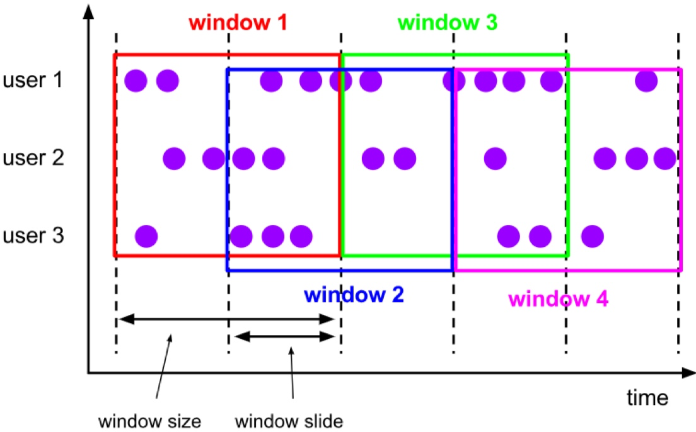

# Flink中的时间和窗口
## Flink中时间的定义
1. 处理时间(processing time):指执行处理操作的机器的系统时间.
2. 事件时间(event time):指每个事件在对应的设备上发生的事件,也就是数据生成的时间.
3. 摄入事件(ingestion time):指数据进入flink数据流时间.

## 水位线
水位线特性:
* 水位线是插入数据流中的一个标记,可以认为是一个特殊的数据.
* 水位线主要的内容是一个时间戳,用来表示当前事件时间的进展.
* 水位线是基于数据的时间戳生成的.
* 水位线的时间戳必须单调递增,以保证任务的事件时间时钟一直向前推进.
* 水位线可以通过设置延迟,来保证处理乱序数据.
* 一个水位线watermark(t),表示当前流中事件时间已经到达了时间戳t,这代表t之前的所有数据都到齐了,之后流中不会出现时间戳t' < t的数据.

.assignTimestampsAndWatermarks()方法需要传入一个WatermarkStrategy作为参数,这就是所谓的“水位线生成策略”,WatermarkStrategy中包含一个“时间戳分配器”(TimestampAssigner)和一个“水位线生成器”(WatermarkGenerator).
```Java
public interface WatermarkStrategy<T> extends TimestampAssignerSupplier<T>, WatermarkGeneratorSupplier<T>
{
@Override
TimestampAssigner<T> createTimestampAssigner(TimestampAssignerSupplier.Context context);
@Override
WatermarkGenerator<T> createWatermarkGenerator(WatermarkGeneratorSupplier.Context context);
}
```
* TimestampAssigner:主要负责从流中数据元素的某个字段提取时间戳,并分配给元素.
* WatermarkGenerator:主要负责按照既定的方式,基于时间戳生成水位线,在WartermarkGenerator接口中,主要又有两个方法:onEvent()和onPeriodicEmit().
    * onEvent:每个事件(数据)到来都会调用的方法,它的参数有当前事件、时间戳,以及允许发出水位线的一个WatermarkOutput,可以基于事件做出各种操作.
    * onPeriodicEmit:周期性调用方法,可以由WatermarkOutput发出水位线.周期时间为处理时间,可以调用环境配置的.setAutoWatermarkInterval()方法来设置,默认为200ms.

### Flink内置水位线生成线
1. 有序流
    * 主要特点就是时间戳单调增长,直接调用WatermarkStrategy.forMonotonousTimestamps()方法,直接拿当前最大时间戳作为水位线就可以了.
    * 时间戳和水位线的单位,必须是毫秒.
2. 乱序流
    * 调用WatermarkStrategy.forBoundedOutOfOrderness()方法就可以实现,这个方法需要传入一个maxOutOfOrderness参数,表示“最大乱序程度”,数据流中乱序数据时间戳的最大差值.
    * 乱序流中生成的水位线真正时间戳是'当前最大时间戳-延迟时间-1'


### 自定义水位线策略
* Flink生成水位线的方式:一种是周期性的(Periodic),一种断点式的(Punctuated).
1. 周期性水位线生成器(Periodic Generator)
    * 周期性生成器一般通过onEvent()观察判断输入事件,而在onPeriodicEmit()里发出水位线.
2. 断点式水位线生成器(Punctuated Generator)
    * 断点式生成器不停地检测onEvent()重的事件,当发现带有水位线信息的特殊事件时,就立即发出水位线.

### 在自定义数据源中发送水位线
* 在自定义数据源中发送水位线之后,就不能再程序中使用assignTimestampAndWatermarks方法来生成水位线.

## 窗口(window)
### 窗口的分类
#### 按照驱动类型分类

1. 时间窗口
    1. Flink中有专门的累表示时间窗口,TimeWindow,这个类有两个私有属性:start和end.
2. 计数窗口
    1. Flink底层是通过全局窗口(global window)来实现的.
#### 按照窗口分配数据的规则分类.
1. 滚动窗口(Tumbling Window)
   
   滚动窗口有固定的大小,是一种对数据进行的“均匀切片”的划分方式.
2. 滑动窗口(Sliding Window)
   
   与滚动窗口的区别在于,窗口之间不是首尾相接的.定义滑动窗口的参数有两个:窗口大小(window size)和滑动步长(window slide)
3. 会话窗口(Session Window)
   
   基于时间定义.
4. 全局窗口(Global Window)
   

### 窗口API概览
#### 按键分区(Keyed)和非按键分区(Non-Keyed)
1. 按键分区窗口(Keyed Windows)
    1. 数据流会按照key分为多条逻辑流,这就是KeyedStream.
2. 非按键分区(Non-Keyed Windows)
    1. 窗口逻辑只能在一个task上执行,相当于并行度为1
#### 代码中窗口API调用
```Java
stream.keyBy(<key selector>)
      .window(<window assigner>)
      .aggregate(<winodw function>)
```
窗口操作只要有两部分:窗口分配器(Window Assigners)和窗口函数(Window Function)

### 窗口分配器(Window Assigners)
#### 时间窗口
1. 滚动处理时间窗口
    * .of()重载方法可以传入两个Time类型参数:size和offset,size是窗口大小,offset是窗口起始点的偏移量.
    ```Java
    stream.keyBy(...)
          .window(TumblingProcessingTimeWindows.of(Time.second(5)))
          .aggregate(...)
    ```
2. 滑动处理时间窗口
    * .of()方法传入两个Time类型参数:size和slide,size表示滑动窗口大小,后者表示滑动窗口的滑动步长.同样可以追加第三个参数,用于指定窗口起始点的偏移量.
    ```Java
    stream.keyBy(...)
          .window()
          .aggregate(SlidingProcessingTimeWindows.of(Time.seconds(10), Time
          .seconds(5)))
    ```
3. 处理时间会话窗口
    * .withGap()方法需要传入一个Time类型的参数size,表示会话的超时时间.
    * .withDynamicGap()方法需要传入一个SessionWindowTimeGapExtractor作为参数.
    ```Java
    stream.keyBy(...)
          .window(ProcessingTimeSessionWindows.withGap(Time.seconds(10)))
          .aggregate(...)
    ```
    ```Java
        .window(ProcessingTimeSessionWindows.withDynamicGap(new SessionWindowTimeGapExtractor<Tuple2<String, Long>>() {
            @Override
            public long extract(Tuple2<String, Long> element) {
            // 提取 session gap 值返回, 单位毫秒
                return element.f0.length() * 1000;
            }
        }))
    ```
4. 滚动事件时间窗口
    ```Java
    stream.keyBy(...)
          .window(TumblingEventTimeWindows.of(Time.seconds(5)))
          .aggregate(...)
    ```
5. 滑动事件时间窗口
    ```Java
    stream.keyBy(...)
          .window(SlidingEventTimeWindows.of(Time.seconds(10), Time.seconds(5)))
          .aggregate(...)
    ```
6. 事件时间会话窗口
    ```Java
    stream.keyBy(...)
          .window(EventTimeSessionWindows.withGap(Time.seconds(10)))
          .aggregate(...)
    ```

#### 计数窗口
1. 滚动计数窗口
    ```Java
    stream.keyBy(...)
          .countWindow(10)
    ```
2. 滑动计数窗口
    ```Java
    stream.keyBy(...)
          .countWindow(10，3)
    ```

#### 全局窗口
* 全局窗口需要自行定义触发器才能实现窗口计算.
    ```Java
    stream.keyBy(...)
          .window(GlobalWindows.create());
    ```

### 窗口函数(Window Functions)

* 窗口函数根据处理方式可以分为两类:增量聚合函数和全窗口函数.
#### 增量聚合函数(incremental aggregation functions)
1. 归约函数(ReduceFunction)
2. 聚合函数(AggregateFunction)
    1. Flink的window API中的aggregate提供了这样的操作,直接基于WindowedStream调用.aggregate()方法.
    2. 接口中的四个方法:
        * createAccumulator():创建一个累加器,为聚合创建一个初始状态,每个聚合任务只会调用一次.
        * add():将输入的元素添加到累加器中.
        * getResult():从累加器中提取聚合的输出结果.
        * merge():合并两个累加器.
    ```Java
    public interface AggregateFunction<IN, ACC, OUT> extends Function, Serializable
    {
        ACC createAccumulator();
        ACC add(IN value, ACC accumulator);
        OUT getResult(ACC accumulator);
        ACC merge(ACC a, ACC b);
    }
    ```
#### 全窗口函数(full window functions)
* 全窗口函数需要先收集窗口中的数据,并在内部缓存起来,等到要输出结果的时候再取出数据进行计算.
1. 窗口函数(WindowFunction)
   * 当窗口到达结束时间需要出发计算时,会调用apply方法.
       ```Java
       stream.keyBy(<key selector>)
             .window(<window assigner>)
             .apply(new MyWindowFunction());
       ```
2. 处理窗口函数(ProcessWindowFunction)
   * ProcessWindowFunction是Window API中最底层的通用窗口函数接口.
   * ProcessWindowFunction可以获得一个“上下文对象”(Context),不仅可以获取窗口信息,还可以访问当前的时间和状态信息.
3. 增量聚合和全窗口函数的结合使用
    ```Java
    // ReduceFunction 与 WindowFunction 结合
    public <R> SingleOutputStreamOperator<R> reduce(
    ReduceFunction<T> reduceFunction, WindowFunction<T, R, K, W> function)
    
    // ReduceFunction 与 ProcessWindowFunction 结合
    public <R> SingleOutputStreamOperator<R> reduce(ReduceFunction<T> reduceFunction, ProcessWindowFunction<T, R, K, W> function)
    
    // AggregateFunction 与 WindowFunction 结合
    public <ACC, V, R> SingleOutputStreamOperator<R> aggregate(
    AggregateFunction<T, ACC, V> aggFunction, WindowFunction<V, R, K, W> windowFunction)
    
    // AggregateFunction 与 ProcessWindowFunction 结合
    public <ACC, V, R> SingleOutputStreamOperator<R> aggregate(AggregateFunction<T, ACC, V> aggFunction, ProcessWindowFunction<V, R, K, W> windowFunction)
    ```

### 其他API
1. 触发器(Trigger)
    * 基于WindowedStream调用.trigger()方法,就可以传入一个自定义窗口触发器(Trigger)
    * 所有事件时间窗口默认触发器是EventTimeTrigger,类似的还有ProcessingTimeTrigger和CountTrigger.
    * Trigger是一个抽象类,自定义时必须实现下面四个抽象方法:
        * onElement():窗口中每到来一个元素,都会调用这个方法.
        * onEventTime():当注册的事件时间定时器触发时,调用这个方法.
        * onProcessingTime():当注册的处理时间定时器触发时,调用这个方法.
        * clear():当窗口关闭销毁时,调用这个方法.
    * 上述前三个方法返回类型都是TriggerResult,这是一个枚举类型:
        * CONTINUE(继续):什么都不做
        * FIRE(触发):触发计算,输出结果
        * PURGE(清除):清空窗口中的所有数据,销毁窗口
        * FIRE_AND_PURGE(触发并清除):触发计算输出结果,并清除窗口
    ```Java
    stream.keyBy(...)
          .window(...)
          .trigger(new MyTrigger())
    ```
2. 移除器(Evictor)
    * 用来定义移除某些数据的逻辑.基于WindowedStream调用.evictor()方法,就可以传入一个自定义的移除器.
    * Evictor接口定义了两个方法:
        * evictBefore():定义执行窗口函数之前的移除数据操作.
        * evictAfter():定义执行窗口函数之后的移除数据操作.
    ```Java
    stream.keyBy(...)
          .window(...)
          .evictor(new MyEvictor())
    ```
3. 允许延迟(Allowed Lateness)
    * 基于WindowedStream调用.allowedLateness()方法,传入一个Time类型的延迟时间,就可以表示允许这段时间内的延迟数据.
    ```Java
    stream.keyBy(...)
          .window(TumblingEventTimeWindows.of(Time.hours(1)))
          .allowedLateness(Time.minutes(1))
    ```
4. 将迟到数据放入侧输入流
    * 基于WindowedStream调用.sideOutputLateData()方法.
    ```Java
    DataStream<Event> stream = env.addSource(...);
    OutputTag<Event> outputTag = new OutputTag<Event>("late") {};
    stream.keyBy(...)
          .window(TumblingEventTimeWindows.of(Time.hours(1)))
          .sideOutputLateData(outputTag)
    ```
    * 基于窗口处理完成之后的DataStream,调用.getSideOutput()方法,传入对应的输出标签,就可以获取迟到数据所在的流.
    ```Java
    SingleOutputStreamOperator<AggResult> winAggStream = stream.keyBy(...)
         .window(TumblingEventTimeWindows.of(Time.hours(1)))
         .sideOutputLateData(outputTag)
         .aggregate(new MyAggregateFunction())
    DataStream<Event> lateStream = winAggStream.getSideOutput(outputTag);
    ```

### 窗口生命周期
