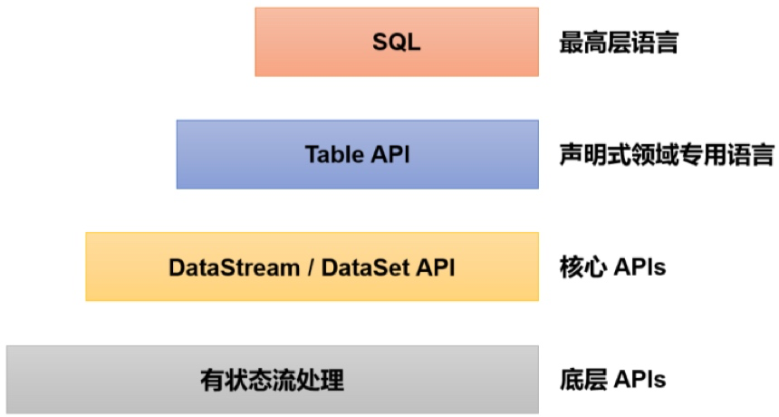

# 处理函数


## 基本处理函数(ProcessFunction)
```Java
public abstract class ProcessFunction<I, O> extends AbstractRichFunction {
    @Override
    public abstract void processElement(I value, Context ctx, Collector<O> out) throws Exception{};
    @Override
    public void onTimer(long timestamp, OnTimerContext ctx, Collector<O> out)
throws Exception {}
}
```

1. 抽象类ProcessFunction继承了AbstractRichFunction,有两个泛函数类型:I表示Input,表示输入的数据类型;O表示Output,表示处理完输出的数据类型.
2. 抽象方法.processElement():用于处理核心逻辑.这个方法对流中每个元素都会调用一次,参数有三个:输入数据值value,上下文ctx,收集器out.
    * value:当前流中输入元素,也就是正在处理的数据,类型与流中数据类型一致.
    * ctx:类型是ProcessFunction中定义的内部抽象类Context,表示当前运行的上下文,可以获取到当前的时间戳.提供了用于查询时间和注册定时器的“定时服务”(TimerService),以及可以将数据发送到“侧输出流”(side output)的方法.output.
        * Context抽象类定义如下:
        ```Java
        public abstract class Context {
        public abstract Long timestamp();
        public abstract TimerService timerService();
        public abstract <X> void output(OutputTag<X> outputTag, X value);
        }
        ```
    * out:用于返回输出数据.调用out.collect()可以向下游发送一个数据.
3. 非抽象方法.onTimer().这个方法只有在注册好的定时器触发时才会使用,而定时器是通过TimerService注册的.onTimer()有三个参数:时间戳(timestamp),上下文(ctx),收集器(out).时间戳指设定好的触发时间.

### 处理函数分类
* Flink提供了8个不同的处理函数:
    * ProcessFunction:基于DataStream直接调用process()时作为参数传入.
    * KeyedProcessFunction:对流按键分区后的处理函数,基于KeyedStream调用process时作为参数传入.支持设置定时器.
    * ProcessWindowFunction:开窗之后的处理函数,也是全窗口函数的代表.基于WindowedStream调用process作为参数传入.
    * ProcessAllWindowFunction:同样是开窗之后的处理函数,基于AllWindowFunction调用process()时作为参数传入.
    * CoProcessFunction:合并两条流之后的处理函数,基于ConnectedStreams调用process()时作为参数传入.
    * ProcessJoinFunction:间隔连接(interval join)两条流之后的处理函数,基于IntervalJoined调用process()时作为参数传入.
    * BroadcastProcessFunction:广播连接流处理函数,基于BroadcastConnectedStream调用process()时作为参数传入.这 里的“广播连接流”BroadcastConnectedStream,是一个未keyBy的普通DataStream与一个广播流(BroadcastStream)做连接(conncet)之后的产物.
    * KeyedBroadcastProcessFunction:按键分区的广播连接流处理函数,同样是基于BroadcastConnectedStream调用process()时作为参数传入.与 BroadcastProcessFunction不同的是,这时的广播连接流,是一个 KeyedStream与广播流(BroadcastStream)做连接之后的产物

## 按键分区处理函数(KeyedProcessFunction)
### 定时器(Timer)和定时服务(TimerService)
* TimerService是flink关于时间和定时器的基础服务接口,包含六个方法:
```Java
// 获取当前的处理时间
long currentProcessingTime();

// 获取当前的水位线（事件时间）
long currentWatermark();

// 注册处理时间定时器，当处理时间超过time时触发
void registerProcessingTimeTimer(long time);

// 注册事件时间定时器，当水位线超过time时触发
void registerEventTimeTimer(long time);

// 删除触发时间为time的处理时间定时器
void deleteProcessingTimeTimer(long time);

// 删除触发时间为time的事件时间定时器
void deleteEventTimeTimer(long time);
```
* 只有基于KeyedStream的处理函数,才能去调用注册和删除定时器方法,未作按键分区的DataStream只能获取当前时间.
* flink对onTimer()和processElement()方法是同步调用的,不会出现状态的并发修改.

### KeyedProcessFunction使用
```Java
public abstract class KeyedProcessFunction<K, I, O> extends AbstractRichFunction
{
    public abstract void processElement(I value, Context ctx, Collector<O> out) throws Exception;
    public void onTimer(long timestamp, OnTimerContext ctx, Collector<O> out) throws Exception {}
    public abstract class Context {...}
}
```
* K表示当前按键分区的key类型.


## 窗口处理函数
### ProcessWindowFunction解析
```Java
public abstract class ProcessWindowFunction<IN, OUT, KEY, W extends Window> extends AbstractRichFunction {
    public abstract void process(KEY key, Context context, Iterable<IN> elements, Collector<OUT> out) throws Exception;
    public void clear(Context context) throws Exception {}
    public abstract class Context implements java.io.Serializable {...}
}
```
* ProcessWindowFunction继承了AbstractRichFunction的抽象类,它有四个类型参数:
    * IN:数据流中窗口任务的输入类型数据.
    * OUT:窗口任务进行计算之后的输出数据类型.
    * KEY:数据中键key的类型.
    * W:窗口类型.一般W就是TimeWindow.
* 全窗口函数不是逐个处理元素的,所以处理方法并不是processElement(),而是process().方法包含四个参数:
    * key:窗口做统计计算基于的键.
    * context:当前窗口进行计算的上下文.它的类型就是ProcessWindowFunction内部定义的抽象类Context。
    * elements:窗口收集到用来计算的所有数据,这是一个可迭代的集合类型.
    * out:用来发送数据输出计算结果的搜集器,类型为Collector.
* 上下文context所包含的内容如下:
```Java
public abstract class Context implements java.io.Serializable {
    public abstract W window();
    public abstract long currentProcessingTime();
    public abstract long currentWatermark();
    public abstract KeyedStateStore windowState();
    public abstract KeyedStateStore globalState();
    public abstract <X> void output(OutputTag<X> outputTag, X value);
}
```
