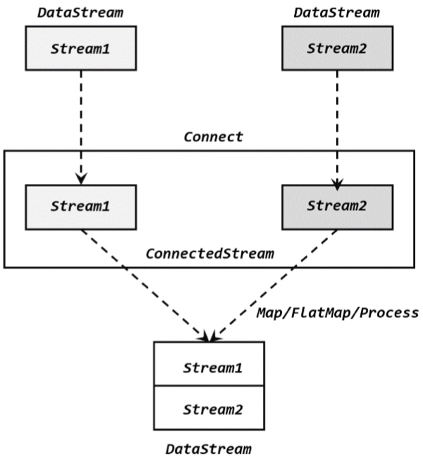

# 多流转换
## 基本合流操作
### 联合(union)
    ```Java
    stream1.union(stream2, stream3, ...);
    ```
### 连接(Connect)

1. 连接流(ConnectedStreams)
    * ConnectedStreams可以直接调用keyBy()进行分区操作,得到的还是一个ConnectedStreams
1. CoProcessFunction
    ```Java
    public abstract class CoProcessFunction<IN1, IN2, OUT> extends AbstractRichFunction {
        public abstract void processElement1(IN1 value, Context ctx, Collector<OUT> out) throws Exception;
        public abstract void processElement2(IN2 value, Context ctx, Collector<OUT> out) throws Exception;
        public void onTimer(long timestamp, OnTimerContext ctx, Collector<OUT> out) throws Exception {}
        public abstract class Context {...}
    }
    ```
2. 广播流
    * 广播状态底层是用一个map保存的.在代码实现上,直接调用DataStream的broadcast方法,传入一个MapStateDescriptor说明状态的名称和类型,就可以得到规则数据的广播流(BroadcastStream).
    ```Java
    MapStateDescriptor<String, Rule> ruleStateDescriptor = new MapStateDescriptor<>(...);
    BroadcastStream<Rule> ruleBroadcastStream = ruleStream.broadcast(ruleStateDescriptor);
    ```
    * BroadcastProcessFunction与CoProcessFunction类似,同样一个抽象类,需要实现两个方法,源码中定义如下:
    ```Java
    public abstract class BroadcastProcessFunction<IN1, IN2, OUT> extends BaseBroadcastProcessFunction {
        public abstract void processElement(IN1 value, ReadOnlyContext ctx, Collector<OUT> out) throws Exception;
        public abstract void processBroadcastElement(IN2 value, Context ctx, Collector<OUT> out) throws Exception;
    }
    ```


## 基于时间的合流--双流联结(Join)
### 窗口联结(Window Join)
1. 窗口联结的调用
    * where的参数是键选择器(KeySelector),用来指定第一条流中的key,equalTo()传入的KeySelector指定了第二条流中key,window()传入的是窗口分配器,apply()实现了一个特殊的窗口函数,这里只能调用apply().
    ```Java
    stream1.join(stream2)
           .where(<KeySelector>)
           .equalTo(<KeySelector>)
           .window(<WindowAssigner>)
           .apply(<JoinFunction>)
    ```
2. 窗口联结的处理过程
   

### 间隔联结(Interval Join)
1. 间隔联结的原理
    * 目前间隔联结只支持事件时间义.
      
2. 间隔联结的调用
    ```Java
    stream1
        .keyBy(<KeySelector>)
        .intervalJoin(stream2.keyBy(<KeySelector>))
        .between(Time.milliseconds(-2), Time.milliseconds(1))
        .process (new ProcessJoinFunction<Integer, Integer, String(){
            @Override
            public void processElement(Integer left, Integer right, Context ctx, Collector<String> out) {
                out.collect(left + "," + right);
            }
        });
    ```


### 窗口同组联结(Window CoGroup)
```Java
stream1.coGroup(stream2)
       .where(<KeySelector>)
       .equalTo(<KeySelector>)
       .window(TumblingEventTimeWindows.of(Time.hours(1)))
       .apply(<CoGroupFunction>)
```
* 调用apply()方法定义具体操作时,传入的是一个CoGroupFunction.源码定义如下:
    ```Java
    public interface CoGroupFunction<IN1, IN2, O> extends Function, Serializable {
        void coGroup(Iterable<IN1> first, Iterable<IN2> second, Collector<O> out) throws Exception;
    }
    ```
    * coGroup()前两个参数传入的是可遍历的数据集合.
    * coGroup操作比窗口的join更加通用,可以实现SQL的“inner join”、“left outer join”、“right outer join”和“full outer join”.


## 总结
1. 分流操作可以通过处理函数的侧输出流(side output)和容易实现.
2. 合流方式有union和connect,两者区别是union可以对多条流进行合并,数据类型必须一致;而connect只能连接两条流,数据类型可以不同.connect提供最底层的处理函数(process function)接口,可以通过状态和定时器实现任意自定义的合流操作,是最通用的合流方式.
3. Flink提供了内置的几个join操作,它们是基于某个时间段的双流合并,是需求特化之后的高层级API.包括window join、interval join和window coGroup.其中window join和coGroup是基于时间窗口的操作,通过apply()来调用;interval join与窗口无关,是基于每个数据元素截取对应的一个时间段来做join,最终处理操作需要调用process().