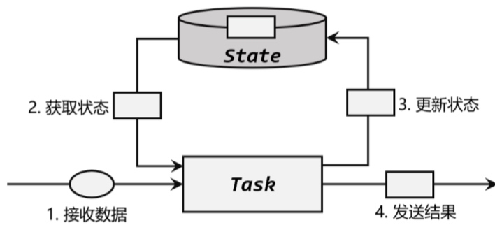
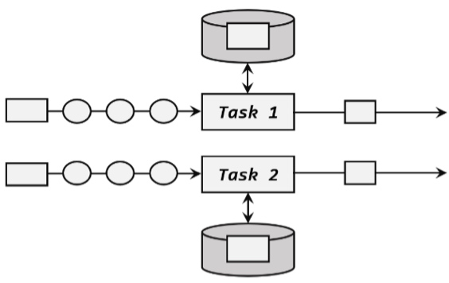
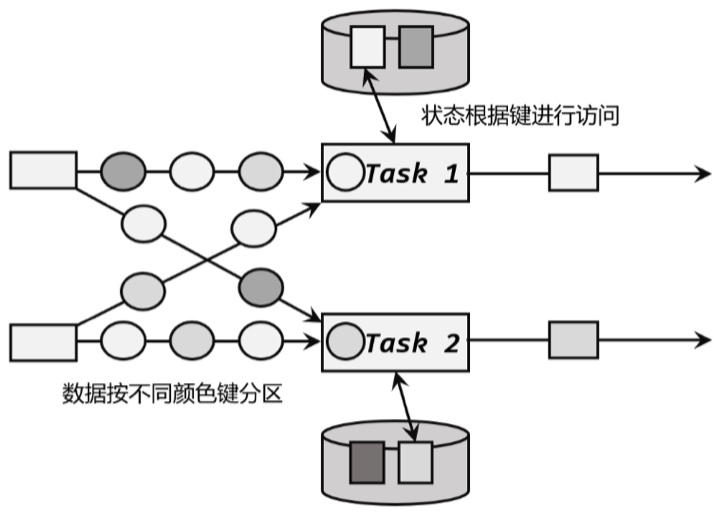

# 状态编程
## Flink中的状态
### 有状态算子

### 状态的分类
1. 托管状态(Managed State)和原始状态(Raw State)
    * 托管状态由Flink统一管理的,状态的存储访问、故障恢复和重组等一系列问题都由Flink实现,我们只要调用接口就可以;原始状态则是自定义的,相当于开辟了一块内存,需要我们管理,实现状态的序列化和故障恢复.
    * 托管状态是由Flink的Runtime来托管;在配置容错机制之后,状态会自动持久化保存.
    * Flink提供了ValueState、ListState、MapState、AggregateState等多种结构.
2. 算子状态(Operator State)和按键分区状态(Keyed State)
    * Flink能管理的状态在并行任务间是无法共享的,每个状态只能针对当前子任务的实例有效.
    * 算子状态(Operator State)
      
        * 状态作用范围限定为当前的算子任务实例,也就是只对当前并行子任务实例有效.
    * 按键分区状态(Keyed State)
      
        * 状态是根据输入流中定义的键来维护和访问的,所以只能定义在按键分区流(KeyedStream)中,也就是keyBy之后才可以使用.
        * 无论Keyed State还是Operator State,都是在本地实例维护的,也就是说每个并行子任务维护着对应的状态,算子的子任务之间状态不共享.

   ## 按键分区状态(Keyed State)
   ### 基本概念和特点
    * Keyed State必须基于KeyedStream,没有进行keyBy分区的DataStream,即使转换算子实现了对应的富函数类,也不能通过运行时上下文访问Keyed State.
   ### 支持的结构类型
    1. ValueState
        ```Java
        public interface ValueState<T> extends State {
            T value() throws IOException;
            void update(T value) throws IOException;
        }
        ```
        * 状态中只保存一个value.
        * value():获取当前状态的值
        * update(T value):对状态进行更新,传入的参数value就是要覆写的状态值.
        * 具体使用时,需要创建一个StateDescriptor提供状态的基本信息.
        ```Java
        public ValueStateDescriptor(String name, Class<T> typeClass) {
            super(name, typeClass, null);
        }
        ```
    2. 列表状态(ListState)
        * 将需要保存的数据,以List形式组织起来
        * Iterable\<T\> get():获取当前的列表状态,返回的是一个可迭代类型的Iterable\<T\>;
        * update(List\<T\> values):传入一个列表values,直接对状态进行覆盖.
        * add(T value):向列表中添加多个元素,以列表values形式传入.
        * addAll(List\<T\> values):向列表中添加多个元素,以列表values形式传入.
        * ListState的状态描述器就叫作ListStateDecriptor.
    3. MapState
        * 把一些kv作为状态整体保存起来,可以认为是一组kv映射的列表.
        * UV get(UK key):传入一个key作为参数,查询对应的value值.
        * put(UK key, UV value):传入一个键值对,更新key对应的value值.
        * putAll(Map<Uk, UV> map):将传入的映射map中所有的键值对,全部添加到映射状态中.
        * remove(UK key):将指定key对应的键值对删除.
        * boolean contains(UK key):判断是否存在指定key,返回一个boolean值.
        * Iterable<Map.Entry<UK, UV>> entries():获取映射状态中所有的键值对.
        * Iterable\<UK\> keys():获取映射状态中所有的key,返回一个可迭代Iterable类型.
        * Iterable\<UV\> values():获取映射状态中所有的value,返回一个可迭代Iterable类型.
        * boolean isEmpty():判断映射是否为空,返回一个boolean值.
    4. ReducingState
        * 规约逻辑的定义,是ReducingStateDescriptor,通过传入一个ReduceFunction来实现.
        ```Java
        public ReducingStateDescriptor(String name, ReduceFunction<T> reduceFunction, Class<T> typeClass) {...}
        ```
    5. AggregatingState
        * 聚合状态也是一个值,用来保存添加进来的所有数据的聚合结果.

   ### 代码实现
    1. 整体介绍
        ```Java
        ValueStateDescriptor<Long> descriptor = new ValueStateDescriptor<>(
            "my state", // 状态名称
            Types.LONG // 状态类型
        );
        ```
        * 操作:首先定义出状态描述器,然后调用getRuntimeContext()方法获取运行时上下文,继而调用RuntimeContext获取状态的方法,将状态描述器传入,就可以得到对应的状态了.
        * 在富函数中,调用getRuntimeContext()方法获取运行时上下文之后,RuntimeContext有以下几个获取状态的方法:
        ```Java
        ValueState<T> getState(ValueStateDescriptor<T>)
        MapState<UK, UV> getMapState(MapStateDescriptor<UK, UV>)
        ListState<T> getListState(ListStateDescriptor<T>)
        ReducingState<T> getReducingState(ReducingStateDescriptor<T>)
        AggregatingState<IN, OUT>
        getAggregatingState(AggregatingStateDescriptor<IN, ACC, OUT>)
        ```
        * 在外部申明状态对象,在open()中通过运行时上下文获取状态.

### 状态生成时间(time-to-live, TTL)
* 配置状态TTL时,需要创建一个StateTtlConfig配置对象,然后调用状态描述器enableTimeToLive()方法启动TTL功能.
    ```Java
    StateTtlConfig ttlConfig = StateTtlConfig
        .newBuilder(Time.seconds(10))
        .setUpdateType(StateTtlConfig.UpdateType.OnCreateAndWrite)
        .setStateVisibility(StateTtlConfig.StateVisibility.NeverReturnExpired)
        .build(); 
    ValueStateDescriptor<String> stateDescriptor = new ValueStateDescriptor<>("my state", String.class);
    stateDescriptor.enableTimeToLive(ttlConfig);
    ```
* 这里用到了几个配置项
    * newBuilder():状态TTL配置的构造器方法,必须调用,返回一个Builder之后再调用build()方法就可以得到StateTtlConfig,方法需要传入一个Time作为参数,就是设定的状态生存时间.
    * setUpdateType():设置更新类型.更新类型制定了什么时候更新状态失效时间,OnCreateAndWrite表示只有创建状态和更改状态(写操作)时更新失效时间.OnReadAndWrite则表示无论读写操作都会更新失效时间,也就是只要对状态进行访问,表示它时活跃的,从而延长生存时间.
    * setStateVisibility():设置状态的可见性.“状态可见性”指因为清楚操作并不是实时的,所以当状态过期之后还有可能基于存在,NeverReturnExpired是默认行为,表示从不返回过期值,也就是只要过期就认为它已经被清楚了,应用不能继续读取.ReturnExpireDefNotCleanedUp,就是如果过期状态还存在,就返回它的值.
* TTL设置只支持处理时间,另外,所有集合类型的状态在设置TTL时,都是针对每一项元素的,一个列表状态中的每一个元素,都会以自己失效时间来清理,而不是整个列表一起清理.

## 算子状态(Operator State)
### 基本概念和特点
* Operator State是一个算子并行实例上定义的状态,作用范围被限定为当前算子任务.算子状态跟数据的key无关,所以不同key的数据只要被分发到同一个并行子任务,就会访问到同一个Operator State.

### 状态类型
1. 列表状态(ListState)
    1. 算子状态的上下文中,不会按key分别处理状态,所以每一个并行子任务上只会保留一个list,也就是当前并行子任务上所有状态项的集合.列表中状态项就是重新分配的最细粒度,彼此之间完全独立.
2. 联合列表状态(UnionListState)
    1. 与ListState类似,联合列表状态也会将状态表示为一个列表.它与常规列表状态的区别在于,算子并行度进行缩放调整时对于状态的分配方式不同.
    2. 在并行度调整时,常规列表状态是轮询分配状态项,而联合列表状态的算子则会直接广播状态的完整列表.
3. 广播状态(BroadcastState)
    1. 所有分区的所有数据都访问同一个状态.
### 代码实现
1. CheckpointedFunction接口
    ```Java
    public interface CheckpointedFunction {
        // 保存状态快照到检查点时，调用这个方法
        void snapshotState(FunctionSnapshotContext context) throws Exception
        // 初始化状态时调用这个方法，也会在恢复状态时调用
        void initializeState(FunctionInitializationContext context) throws Exception;
    }
    ```
    * 每次应用保存检查点做快照时,都会调用snapshotState()方法,将状态进行外部持久化.算子任务进行初始化时,调用initializeState().
    * snapshotState()方法拿到的是快照上下文FunctionSnapshotContext,它可以提供检查点的相关信息,不过无法获取状态句柄,而initializeState()拿到的是FunctionInitializationContext,这是函数类进行初始化时的上下文,是真正的“运行时上下文”.
    * 算子状态注册和使用之前需要先定义一个状态描述器(StateDescriptor),然后从上下文提供的算子状态存储中获取对应状态对象.

## 广播状态(Broadcast State)
### 基本用法
* 将动态的配置数据看作是一条流,将这条流和本身要处理的数据流进行connect,就可以实时地更新配置计算了.
* 代码实现上,直接调用DataStream的broadcast()方法,传入一个MapStateDescriptor说明状态的名称和类型,就可以得到一个BroadcastStream,进而将要处理的数据流与这条BroadcastStream进行connect,就可以得到BroadcastConnectedStream.
```Java
MapStateDescriptor<String, Rule> ruleStateDescriptor = new
MapStateDescriptor<>(...);
BroadcastStream<Rule> ruleBroadcastStream = ruleStream
    .broadcast(ruleStateDescriptor);
DataStream<String> output = stream
    .connect(ruleBroadcastStream)
    .process( new BroadcastProcessFunction<>() {...} );
```
* BroadcastConnectedStream调用process()方法,可以传入KeyedBroadcastProcessFunction/BroadcastProcessFunction.KeyedBroadcastProcessFunction/BroadcastProcessFunction中有两个方法:
```Java
public abstract class BroadcastProcessFunction<IN1, IN2, OUT> extends BaseBroadcastProcessFunction {
    ...
    public abstract void processElement(IN1 value, ReadOnlyContext ctx, Collector<OUT> out) throws Exception;
    public abstract void processBroadcastElement(IN2 value, Context ctx, Collector<OUT> out) throws Exception;
    ...
}
```
* processElement()方法处理正常数据流,第一个参数是当前到来的流,processBroadcastElement()方法相当于用来处理BroadcastStream,它的第一个参数value是处理BroadcastStream中的规则或者配置数据.两个方法中第二个参数都是一个上下文ctx,可以通过调用getBroadcastState()方法获取当前的广播状态,区别在于,processElement()方法中上下文是ReadOnly的,获取的广播状态只能读不能更改;processBroadcastElement()方法里Context没有限制,可以根据当前BroadcastStream中的数据更新状态.

## 状态持久化和状态后端
### Checkpoint
* 所有任务的状态在某个时间点的一个快照.

### 状态后端(State Backends)
* 状态后端负责两件事:本地的状态管理和Checkpoint写入远程的持久化存储.

1. State Backends的分类
    * Flink提供了两种不同的状态后端,一种是HashMapStateBackend,一种是EmbeddedRocksDBStateBackend,默认是HashMapStateBackend.
    * HashMapStateBackend
        * 状态存放在内存里.
        * 具体实现,HashMapStateBackend会直接把状态当作对象,保存在TaskManager的JVM heap上.
        * Checkpoint一般保存在分布式文件系统中,也可以通过CheckpointStorage另外指定.
        * HashMapStateBackend将状态放在内存中,可以获得最快的读写速度,计算性能达到最佳,但是内存占用大,适用于大状态、长窗口、大键值状态的作业.
    * EmbeddedRocksDBStateBackend
        * 状态主要放在RocksDB中,数据被存储为序列化的Byte Arrays,读写操作需要序列化/反序列化,所以访问性能差一些,因为做了序列化,key的比较是按照字节进行的,而不是直接调用hashCode()和equal()方法.
        * EmbeddedRocksDBStateBackend是异步快照,而且它提供了增量式保存检查点的机制,可以大大提升保存的效率.
        * 适合状态非常大、窗口非常长、键/值状态很大的场景.
2. 状态后端的配置
    1. 配置默认的状态后端
        * 在flink-conf.yaml中,可以使用state.backend配置默认状态后端.配置项可以是hashmap/rocksdb.
    2. 为per-job单独配置状态后端
        ```Java
        //HashMapStateBackend
        StreamExecutionEnvironment env = StreamExecutionEnvironment.getExecutionEnvironment();
        env.setStateBackend(new HashMapStateBackend());
        //EmbeddedRocksDBStateBackend
        StreamExecutionEnvironment env = StreamExecutionEnvironment.getExecutionEnvironment();
        env.setStateBackend(new EmbeddedRocksDBStateBackend());
        ```
        